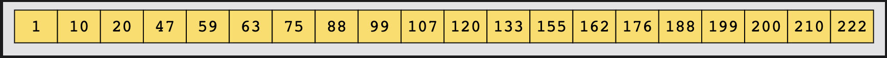
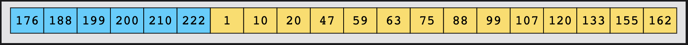

#### Search in Rotated Sorted Array

Given a sorted integer array, `nums`, and an integer value, `target`, the
array is rotated by some arbitrary number. Search and return the index of
`target` in this array. If the `target` does not exist, return `-1`.

An original sorted array before rotationis given below:

After rotating this array 6 times, it changes to:

We are given an array of integers, `nums`, sorted in ascending order, and an
integer value, `target`. If the `target` exists in the array, return its index.
If the `target` does not exist, return `-1`.

**Constraints**:

1. All values in `nums` are unique.
2. The values in `nums` are sorted in ascending order.
3. The array may have been rotated by some arbitrary number.
4. `1 <= nums.length <= 1000`
5. `-10000 <= nums[i] <= 10000`
6. `-10000 <= target <= 10000`
