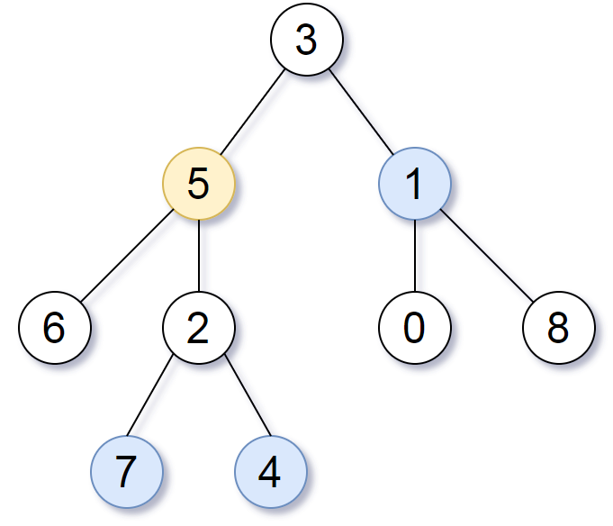

#### All Nodes Distance K in Binary Tree

Given the `root` of a binary tree, the value of a target node `target`, and an
integer `k`, return _an array of the values of all nodes that have a distance_
`k` _from the target node_.

You can return the answer in any order.

**Example 1**:

<pre><b>Input</b>: root = [3,5,1,6,2,0,8,null,null,7,4], target = 5, k = 2
<b>Output</b>: [7,4,1]
<b>Explanation</b>: The nodes that are a distance 2 from the target node (with value 5)
have values 7, 4, and 1.
</pre>

**Example 2**:

<pre><b>Input</b>: root = [1], target = 1, k = 3
<b>Output</b>: []
</pre>

**Constraints**:

- The number of nodes in the tree is in the range `[1, 500]`.
- `0 <= Node.val <= 500`
- All the values `Node.val` are unique.
- `target` is the value of one of the nodes in the tree.
- `0 <= k <= 1000`
