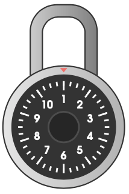

#### Rotary Lock

You're trying to open a lock. The lock comes with a wheel which has the
integers from `1` to `N`arranged in a circle in order around it (with integers
`1` and `N` adjacent to one another). The wheel is initially pointing at `1`.

For example, the following depicts the lock for `N = 10`.

It takes `1` second to rotate the wheel by `1` unit to an adjacent integer in
either direction, and it takes no time to select an integer once the wheel is
pointing at it. The lock will open if you enter a certain code. The code
consists of a sequence of `M` integers, the `i`th of which is
<code>Ci</code>. Determine the minimum number of seconds required to
select all `M` of the code's integers in order.

**Constraints**:

- `3 <= N <= 50,000,000`
- `1 <= M <= 1,000`
- <code>1 <= Ci <= N</code>
